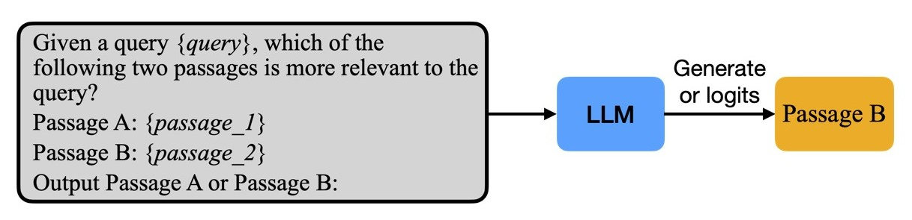

<h1 align="center">
    <a href="https://github.com/avnlp/prp">Pairwise Ranking Prompting (PRP)</a>
</h1>

<div align="center">

[](https://deepwiki.com/avnlp/prp)
[](https://github.com/avnlp/prp/actions/workflows/ci.yml)
[](https://codecov.io/gh/avnlp/prp)
[](https://github.com/avnlp/prp/actions/workflows/ci.yml)
[](https://github.com/avnlp/prp/actions/workflows/ci.yml)
[](https://github.com/avnlp/prp/actions/workflows/ci.yml)
[](https://github.com/avnlp/prp/actions/workflows/ci.yml)
[](https://github.com/avnlp/prp/blob/main/LICENSE)

</div>

## Overview

Pairwise Ranking Prompting (PRP) is an LLM-based document reranking technique that improves search quality by comparing documents in pairs rather than scoring them individually. By using bidirectional comparisons (A vs B and B vs A), PRP effectively mitigates the position bias common in LLMs, producing more reliable relevance judgments.

This repository provides an implementation of PRP based on the paper [Large Language Models are Effective Text Rankers with Pairwise Ranking Prompting](https://arxiv.org/abs/2306.17563).

### Key Features

- **Efficient Sorting Algorithms**: Utilizes HeapSort and BubbleSort-inspired sliding window methods to reduce LLM inference calls.
- **Structured Generation with Pydantic Validation**: Ensures accurate zero-shot ranking, even on smaller LLMs.
- **OpenAI-compatible LLM API**: Supports any OpenAI-compatible API (OpenAI, Groq, local models, etc.).
- **Evaluation Toolkit**: Custom Evaluator and Dataloader for standard metrics (NDCG, MAP, Recall, Precision) using the `ir_datasets` library.

## Ranking Strategies



PRP uses pairwise comparisons to rank documents. Figure taken from [Setwise Ranking](https://arxiv.org/abs/2310.09497).

This implementation provides three PRP-based ranking strategies:

### 1. `all_pair`

- Enumerates all pairs and performs global aggregation to generate a score for each document.
- If the LLM consistently prefers `Document-A` over `Document-B`, `Document-A` gets one point.
- When the LLM produces conflicting or irrelevant results, each document gets half a point. Ties fall back to initial ranking.
- Highly insensitive to input ordering—ranks documents by win ratio.
- Drawback: Costly $O(N^2)$ calls to LLM APIs.

### 2. `heapsort`

- Uses pairwise preferences from the LLM as a comparator with HeapSort.
- Favors lower computation complexity than `all_pair` while being largely insensitive to input orders.
- Makes $O(N \log N)$ calls to LLM APIs.

### 3. `sliding_k`

- Uses a sliding window starting at the bottom of the initial ranking, comparing and swapping document pairs with a stride of 1 (similar to BubbleSort).
- Performs the sliding window operation `k` times to optimize for `top-k` results.
- Complexity is $O(K \times N)$.
- Has favorable time complexity but higher dependency on input order.

### Comparison of Ranking Strategies

| Method | API Calls | Parallelizable | Order Sensitivity | Best For |
|--------|-----------|----------------|-------------------|----------|
| `all_pair` | O(N²) | Yes | Low | Highest quality, smaller document sets |
| `heapsort` | O(N log N) | No | Low | General purpose (recommended) |
| `sliding_k` | O(K×N) | No | Higher | Large document sets, top-k optimization |

### Position Bias Mitigation

LLMs often exhibit **position bias**—they may prefer whichever document appears first (or second) in the prompt, regardless of actual relevance. To detect and mitigate this, PRP compares each document pair **bidirectionally**:

1. First comparison: "Is Document A or Document B more relevant?"
2. Second comparison: "Is Document B or Document A more relevant?"

The results are then reconciled:

- **Both comparisons agree** → Clear winner (1 point to preferred document)
- **Comparisons conflict** → The LLM's preference was based on position, not relevance → Tie (0.5 points each)
- **Ties in final scores** → Fall back to initial ranking order

## Evaluation

We evaluated `PairwiseRankingPrompting` using Haystack-based pipelines:

1. **Document Retrieval**: BM25 retrieves top-100 candidates from the corpus
2. **Reranking**: PRP reranks candidates using pairwise comparisons
3. **Evaluation**: Compute NDCG, MAP, Recall, and Precision at various cutoffs

**Supported Datasets**: Any dataset from [ir_datasets](https://ir-datasets.com/). We evaluated on:

- **BEIR**: FIQA (financial), SciFact (scientific claims), NFCorpus (nutrition/medical)
- **TREC**: TREC-DL 2019 and TREC-DL 2020 (MS MARCO passage ranking)

The evaluation pipelines can be found in the [pipelines](src/prp/pipelines) directory.

### Results (NDCG@10)

| **Model** | **Ranker** | **FiQA** | **SciFACT** | **NFCorpus** | **TREC-19** | **TREC-20** |
|-----------|------------|----------|-------------|--------------|-------------|-------------|
| Mistral | PRP-sliding_k | 0.4664 | 0.6847 | 0.4261 | 0.7062 | 0.6860 |
| Mistral | PRP-heapsort | 0.4672 | 0.6860 | 0.4311 | 0.7134 | 0.6875 |
| Mistral | PRP-allpair | 0.4676 | 0.6860 | 0.4312 | 0.7186 | 0.6987 |
| Phi-3 | PRP-sliding_k | 0.4704 | 0.6980 | 0.4365 | 0.7202 | 0.7140 |
| Phi-3 | PRP-heapsort | 0.4712 | 0.6990 | 0.4385 | 0.7226 | 0.7154 |
| Phi-3 | PRP-allpair | 0.4714 | 0.7028 | 0.4386 | 0.7228 | 0.7167 |
| Llama-3 | PRP-heapsort | 0.4764 | 0.7765 | 0.4423 | 0.7508 | 0.7637 |
| Llama-3 | PRP-sliding_k | 0.4793 | 0.7852 | 0.4503 | 0.7511 | 0.7642 |
| Llama-3 | PRP-allpair | **0.4992** | **0.7912** | **0.4658** | **0.7623** | **0.7671** |

**Key findings:**

- `PRP-allpair` performed best across all datasets
- Llama-3 with `PRP-allpair` achieved the highest scores overall
- `PRP-heapsort` offers a good balance of quality and efficiency

## Installation

Clone the repository:

```bash
git clone https://github.com/avnlp/prp.git
cd prp
```

Install dependencies using [uv](https://docs.astral.sh/uv/):

```bash
uv sync
```

## Usage

```python
from prp import PairwiseRankingPrompting

# Initialize PRP-based reranker
reranker = PairwiseRankingPrompting(
    model_name="meta-llama/Llama-3.1-8B-Instruct",
    api_key="API_KEY",
    base_url="BASE_URL"
)

query = "What are the benefits of regular exercise?"
documents = [
    "Engaging in regular exercise enhances cardiovascular fitness and helps regulate blood pressure.",
    "The Moon is Earth's only natural satellite and affects tides on the planet.",
    "Going to the gym regularly can help build muscle strength and improve mental health.",
]

# Use sliding_k to pick top 2 items
results_sliding_k = reranker.rerank(
    query, documents, method="sliding_k", top_k=2
)

# Rank all documents with heapsort (recommended)
results_heapsort = reranker.rerank(
    query, documents, method="heapsort"
)

# Rank all documents with all_pair (highest quality)
results_allpairs = reranker.rerank(
    query, documents, method="all_pair"
)
```

## Documentation

For detailed API documentation, see:

- [Ranker API](docs/rankers.md) - Parameters, methods, and usage examples
- [Evaluation](docs/evaluation.md) - Evaluator API and metrics
- [Data Loading](docs/dataloader.md) - Dataset loading and structure
- [Configuration](docs/configuration.md) - YAML configuration schemas

## Contributing

Please see the [CONTRIBUTING.md](CONTRIBUTING.md) file for detailed contribution guidelines.

## License

This project is licensed under the MIT License - see the [LICENSE](LICENSE) file for details.
